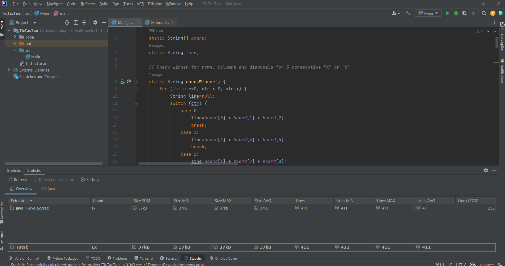

# **TicTacToe**

TicTacToe - Play against computer - You can never win in this Tic Tac Toe game.

**Team Members**
atanu.pal@nagarro.com
renu.singh@nagarro.com

**About TicTacToe: How to Play**

**Rules** 
Two players take turns playing on a three-by-three board. One player plays Xs and the other player (computer) plays Os until one player wins by placing three of his marks in a row, horizontally, vertically, or diagonally

**LOC Screenshot** (252 Lines of Code)

**Set-up Details**
Follow these steps to setup the TicTacToe game

1. **Download the Game** To begin your TicTacToe Game, download the below mentioned repository to your local machine as a ZIP file.
GIT Url: https://atanupal-nagarro/TicTacToe

2. **Java Pre-requisite** Make sure you that Java is installed on your computer. The game requires Java 8 or a higher version to run.

3. **Compile and Run the Game**

If you prefer using a Java Integrated Development Environment (IDE) such as IntelliJ IDEA, use the below steps: 
a. Download the GitHub ZIP file.
b. Extract the GitHub Downloaded ZIP file to local machine.
c. Open the extracted folder in IDE.
d. Open the Main.java file (optional).
e. Run the program in the IDE.

o You can even use command line, navigate to the game's directory and follow these steps:
a. Compile the code with the following command: javac Main.java	
b. Run the game using: java Main

**Game Screenshots**
1. Computer Win Case:

<pre>
|-----|-----|-----|

|  X  |  X  |  O  |

|-----------------|

|  X  |  O  |  6  |

|-----------------|

|  O  |  8  |  9  |

|-----|-----|-----|
</pre>

Computer won! Thanks for playing.
Want to play again (y/n)?

2. Draw Case: Both computer and You do not win, it’s a draw.

<pre>
|-----|-----|-----|

|  X  |  O  |  X  |

|-----------------|

|  X  |  O  |  O  |

|-----------------|

|  O  |  X  |  X  |

|-----|-----|-----|
</pre>

It's a draw! Thanks for playing.
Want to play again (y/n)?

**Error Handling Coverage**

<pre>
1. Want to play again: Accepts only y/n as input

Want to play again (y/n)?
a
Please enter either "y" or "n" only (case-insensitive)

-1
Please enter either "y" or "n" only (case-insensitive)

2. X's turn; enter a slot number to place X in:

a
Input is not INT, please re-enter slot number:

10
Please enter integer number between 1 and 9, please re-enter slot number:

1
Slot already taken, please re-enter slot number....

</pre>

